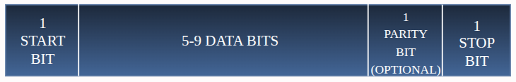
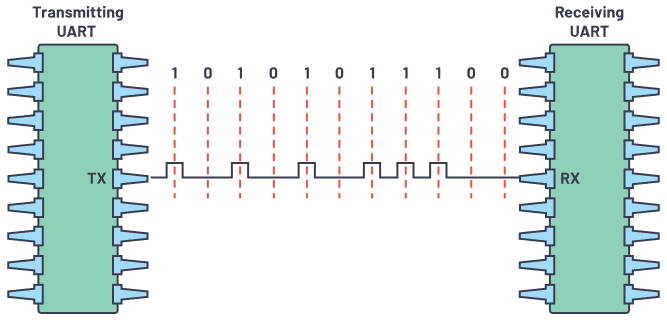
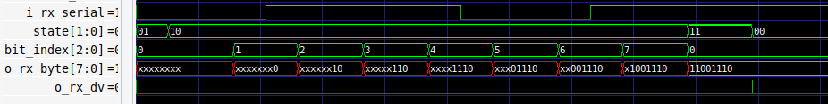
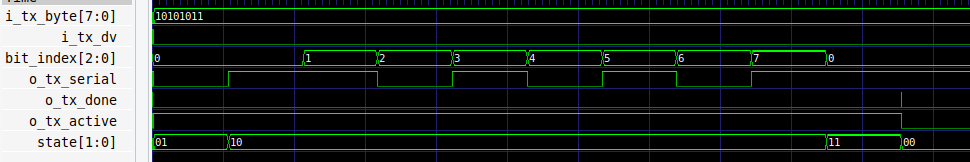
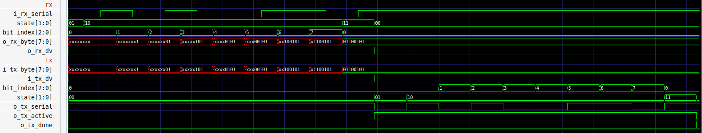
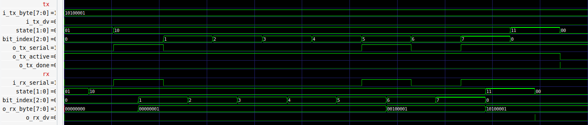

# UART (TX & RX) in Verilog
This repository contains a **Verilog HDL design and testbench** implementation of a **Universal Asynchronous Receiver/Transmitter (UART)**, including both **transmitter (TX)** and **receiver (RX)** modules.


## Features

- UART **Transmitter (TX)** module  
- UART **Receiver (RX)** module  
- Configurable baud rate  
- Testbenches for both TX & RX  
- Synthesizable RTL code  
- Compatible with FPGA implementation  

## Repository Structure
├── src/  
│   ├── uart_tx.v  
│   └── uart_rx.v  
│  
├── tb/  
│   ├── tb_uart_tx.v  
│   ├── tb_uart_rx.v  
│   ├── tb_rx_tx.v  
│   └── tb_tx_rx_loop.v  
│  
├── docs/  
│   ├── uart_frame.png  
│   ├── uart_block_diagram.png  
│   └── uart_waveform.png  
│  
├── README.md  
└── .gitignore  

## UART Basics

UART is a **serial communication protocol** that transmits and receives data **asynchronously** (without a shared clock).  
A typical UART frame looks like:



- **Start bit** → Always `0` (low)  
- **Data bits** → Usually 8 bits (LSB is transmitted first)
- **Parity bit** → Checks the correctness of the data byte received (Optional)
- **Stop bit(s)** → One or more `1` (high)  

## Block Diagram




## UART Frame Example

Following are waveform screenshots captured from the simulation(VCD files):

- Transmission of serial data (`0xBE`) from the testbench to the UART Receiver module.  
   

- Parallel transmission of a data byte (`0xAB`) from the testbench to the UART Transmitter module.  
   

- Serial data (`0x65`) sent from the testbench to the UART Receiver, with the Receiver’s output connected to the Transmitter module.  
   

- Parallel data byte (`0xA1`) sent from the testbench to the UART Transmitter, with the Transmitter’s output connected to the Receiver module.  
   


## How to Run

### Requirements:
  Tools used to simulate these files are: 
  1. Verilog simulator (Icarus Verilog / ModelSim / Vivado)
  2. GTKWave (for waveform visualization)

### Command for compiling files with Icarus Verilog and viewing waveforms using GTKWave:
```
  iverilog -o (output_file_name) (design_files) (testbench_files)
  vvp (output_file_name)
  gtkwave (vcd_file_name)
```

### Example:
  1. Simulation of uart_rx module
     ```
        iverilog -o rx ../src/uart_rx.v ../tb/tb_uart_rx.v
        vvp rx
        gtkwave rx.vcd
     ```
  2. Simulation of uart_tx module
     ```
        iverilog -o tx ../src/uart_tx.v ../tb/tb_uart_tx.v
        vvp tx
        gtkwave tx.vcd
     ```
   3. Simulation of full connection RX -> TX
      ```
         iverilog -o rx_tx ../src/*.v ../tb/tb_rx_tx_loop.v
         vvp rx_tx
         gtkwave rx_tx.vcd
      ```
   4. Simulation of full connection TX -> RX
      ```
         iverilog -o tx_rx ../src/*.v ../tb/tb_tx_rx_loop.v
         vvp tx_rx
         gtkwave tx_rx.vcd
      ```


## Resources
1. [UART Basics – Analog Devices](https://www.analog.com/en/resources/analog-dialogue/articles/uart-a-hardware-communication-protocol.html)
2. [Icarus Verilog](https://steveicarus.github.io/iverilog/index.html)
3. [GTKWave Viewer](https://gtkwave.sourceforge.net/)
4. [UART Basics – Wikipedia](https://en.wikipedia.org/wiki/Universal_asynchronous_receiver-transmitter)  
5. [FPGA UART Tutorial (Nandland)](https://nandland.com/uart-communication-in-fpga/)  
6. [Serial Communication Basics](https://learn.sparkfun.com/tutorials/serial-communication)  